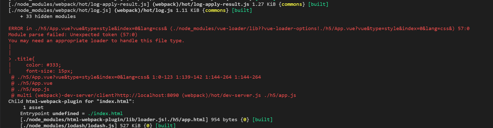

## 第一天

### 一、文件介绍

 > h5手机端的代码

 > resource:spa.md文件所需资源

 > pc文件夹：pc端的代码

 > mockServer:模拟的数据目录

 > static:公共的静态资源文件img/css/js/font

 >> css:

 >> font:

 >> img:

 >> scss:scss源文件

 >> js:

 >> typescript:

 > statich5:h5的静态资源文件

 > staticpc:pc的静态资源文件

 > .babelrc:babel的配置文件

 > webpack.h5.base.conf.js:h5基础配置文件，对代码的解析，资源的loader，插件的使用

 > webpack.h5.dev.conf.js:h5开发配置文件，会使用到基础配置文件

 > webpack.h5.prod.conf.js:h5生产机配置文件，会使用到基础配置文件

 > webpack.h5.test.conf.js:h5测试配置文件，会使用到基础配置文件

### 二、初始化文件

#### cd spa && npm init 创建了package.json文件，选项全部默认

##### 安装：npm install --save-dev webpack webpack-cli webpack-dev-server webpack-merge vue vue-loader  babel-loader  babel-preset-env path html-webpack-plugin
* webpack3之后就需要再安装webpack-cli
* npm安装慢的话，[淘宝cnpm欢迎你](https://npm.taobao.org/ "我的npm镜像")

##### 配置webpack.h5.base.conf.js和webpack.h5.dev.conf.js文件,详细说明请移驾到该文件
##### 在h5新建例子App.vue/app.js/app.html和components文件夹中的SelfNav.vue
* 1、配置完之后在package.json的scripts里增加一行 "hdev": "webpack-dev-server --inline --config webpack.h5.dev.conf.js --open",该命令启动了webpack-dev-server服务器，并不会在本地磁盘上生成mobile文件
* 命令行运行npm run hdev,此时错误等着你

##### 缺少babel-core,该包是babel核心编译包，那就安装咯！ 
* npm install --save-dev babel-core

* 继续运行npm run hdev,又报了vue-template-compiler依赖未安装
* npm install --save-dev vue-template-compiler

== vue-template-compiler:

* 此时就可以看到运行成功了

* 2、配置生产环境的编译命令 "hprod": "webpack --config webpack.h5.prod.conf.js"

* 运行npm run hprod

## 第二天

在昨天的基础上在App.vue的文件的style加上css样式，报了css解析出错，如下图所示

* 需要在webpack配置文件中配置css解析loader,npm安装style-loader和css-loader> npm install --save-dev style-loader css-loader,配置文件参考webpack.h5.base.conf.js中的plugin部分

* 此时发现，css样式是插入到html文件的head中，这不符合前端的文件管理，需要拆散它们

* 从html文件中抽离css样式用到mini-css-extract-plugin插件，而extract-text-webpack-plugin已经被废弃了；npm install --save-dev mini-css-extract-plugin；并把上一步配置的style-loader注释掉，再运行，css文件已抽离出来

#### 为项目添加scss支持，安装sass-loader和node-sass

* webpack上配置sass，把之前插件上加载css部分再加上sass的loader

 
