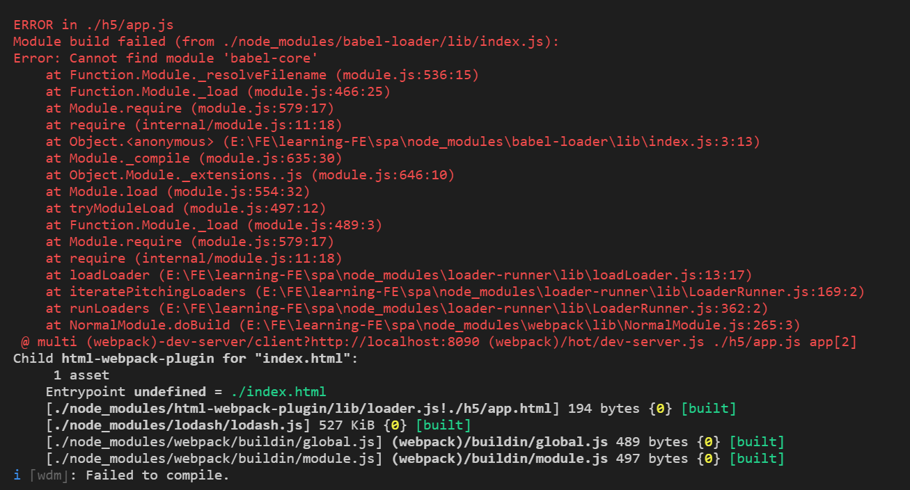

### 文件介绍

> h5手机端的代码
> resource:spa.md文件所需资源
> pc文件夹：pc端的代码
> mockServer:模拟的数据目录
> static:公共的静态资源文件img/css/js/font
>> css:
>> font:
>> img:
>> scss:scss源文件
>> js:
>> typescript:

> statich5:h5的静态资源文件
> staticpc:pc的静态资源文件
> .babelrc:babel的配置文件
> webpack.h5.base.conf.js:h5基础配置文件，对代码的解析，资源的loader，插件的使用
> webpack.h5.dev.conf.js:h5开发配置文件，会使用到基础配置文件
> webpack.h5.prod.conf.js:h5生产机配置文件，会使用到基础配置文件
> webpack.h5.test.conf.js:h5测试配置文件，会使用到基础配置文件

#### cd spa && npm init 创建了package.json文件，选项全部默认

安装：npm install --save-dev webpack webpack-cli webpack-dev-server webpack-merge vue vue-loader  babel-loader  babel-preset-env path html-webpack-plugin
* webpack3之后就需要再安装webpack-cli
* npm安装慢的话，[淘宝cnpm欢迎](https://npm.taobao.org/ "我的npm镜像")

##### 配置webpack.h5.base.conf.js和webpack.h5.dev.conf.js文件,详细说明请移驾到该文件
##### 在h5新建例子App.vue/app.js/app.html和components文件夹中的SelfNav.vue
* 配置完之后在package.json的scripts里增加一行"hdev": "webpack-dev-server --inline --config webpack.h5.dev.conf.js --open"
* 命令行运行npm run hdev,此时错误等着你
